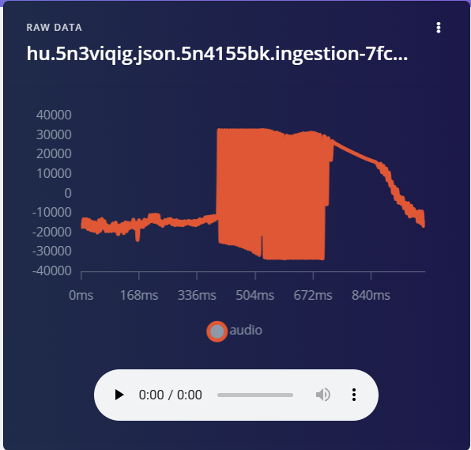
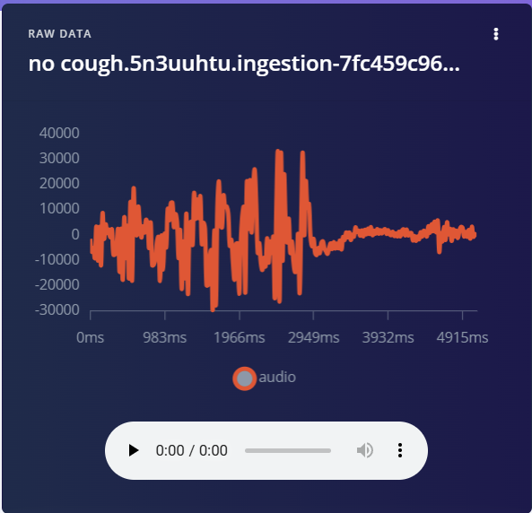
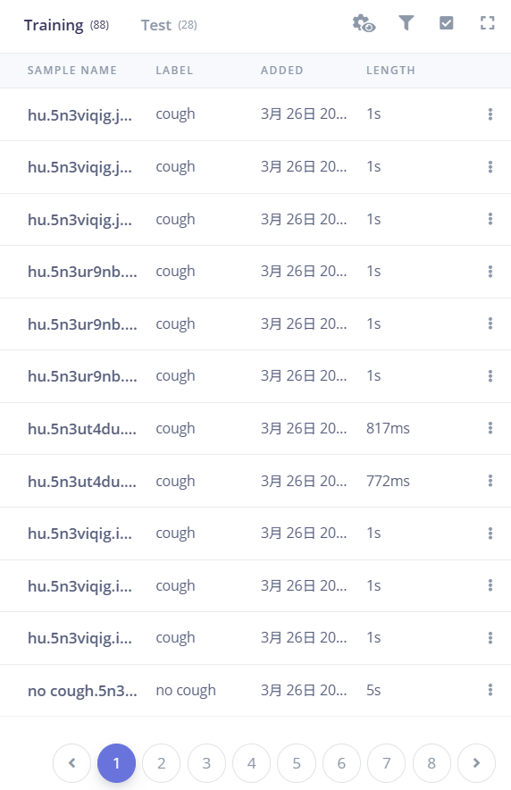
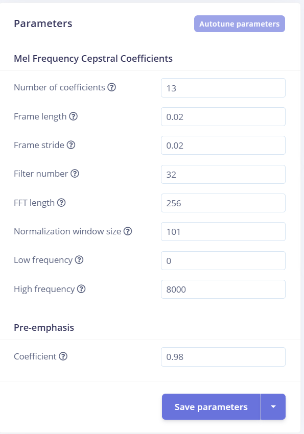
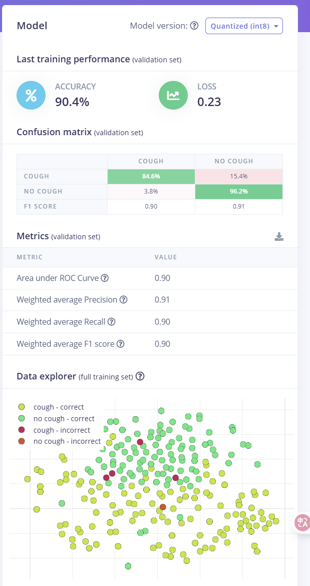

# Cough recognition system based on Edge Impulse
 
 Name of author:Qiqing Dai
 Edge Impulse:[Edge Impulse ](https://studio.edgeimpulse.com/studio/655603/impulse/1/learning/keras/4)
 
 ## Introduction
 The inspiration for this project comes from the overall health status of students in CE lab during the flu season. I found that whenever the flu season comes or when the air quality is poor, CE students often experience frequent coughing and illness. However, ordinary people find it difficult to notice at the beginning that coughing is an abnormal signal that triggers illness, and often overlook this phenomenon. Therefore, the Cough System project aims to combine embedded AI and deep learning to establish a cough monitoring system to assist students in providing feedback on abnormal bodily signals.
This project aims to distinguish cough sounds from environmental background sounds in CE lab through a voice recognition model. When a student in CE lab makes a cough sound, the system will switch from a long green light to a red light state, and a buzzer will sound an alarm to remind the student to pay attention to their physical condition, thus achieving real-time feedback.
Due to the fact that existing health products and related research are mainly focused on special application scenarios (such as hospitals), or because high-performance devices require high prices, this project combines edge impulse deep learning for cough sound recognition and deploys it to nano 33 ble for real-time sound feedback, with an accuracy rate of 90%. It has good significance in building low-power cough detection systems, especially in the field of health (Chakraborty, 2022).

 ## Research Question
 The research question of this project is how to build a low-power, low-cost, and real-time feedback embedded deep learning AI model system that can distinguish cough sounds from environmental background noise in CE lab, so that students can enhance their health awareness when coughing abnormally?
 
 
 ## Application Overview
The Cough system mainly consists of three modules: Arduino Nano BLE, LED, and Buzzer, which are used to monitor cough and provide real-time feedback in CE Lab. The most important module among them is Arduino Nano BLE, which not only has microphone function, but also can continuously collect different sounds in the environment during the initial stage of the project, playing the role of collecting different background audio data and cough data (Edge Impulse, 2022). After the relevant audio data is trained to recognize cough abnormal events and other environmental noise through edge impulse, the model can be installed inside Nano BLE, which is the most core part of the system. The combination of LED lights and Buzzer provides real-time feedback on cough sounds detected in the environment: in the absence of cough sounds detected in environmental noise, the green LED light will remain on, indicating a healthy state; Once coughing is detected in the ambient sound, the LED green light goes out, the LED red light lights up, and at the same time, Buzzer emits a beep warning to remind people to be aware of abnormal physical conditions. Compared with various large-scale high-performance health care system testing, the above three sections Lower cost, more flexible deployment, and meaningful in the field of health.

 
 ## Data
All audio data used to train the model was collected and recorded through Arduino 
Nano 33 BLE, and the data mainly came from two parts: the first part of the audio data mainly recorded the coughing sounds made by students in CE lab under different conditions, and the second part of the audio data mainly recorded various environmental sounds in the laboratory besides coughing sounds (such as the sound of classmates talking, typing and typing on the keyboard, etc.). All of these audio data are processed uniformly on edge impulse.
Firstly, I filter the collected data, listen to all audio, delete meaningless and noisy audio, and then classify and label the available audio data. All cough sounds collected are classified as "cough" category, while all other environmental noise is classified as "no cough" category. Then I processed the data more accurately, slicing the collected audio into 1-second segments. The next step is to extract and analyze the features of these audios, using the MFCC algorithm to encode all audio data features, in order to facilitate model training and identify cough features. Although it was difficult to collect data on cough, I ultimately obtained 100 pieces of data, 80% for training and 20% for validation. Although the 100 data samples were not large-scale datasets, the cough system model also showed good accuracy in the final testing.
 
 
 

 
 ## Model
In order to accurately distinguish cough sounds from environmental sounds, the Cough system uses the 1D CNN model in Edge Impulse. Firstly, the model input is a 650 dimensional MFCC with a 13 column format in the Reshape layer, which can be adapted for subsequent convolution processing (Sainath et al., 2015). There are two sets of convolution pooling modules for the cough system model, as follows: the first layer has 8 convolution kernels, and the second layer has 16 convolution kernels.
At the beginning of designing the model, I also wanted to try other different model structures in order to improve the accuracy of model training. I have had three different attempts: Dense, LSTM, and CNN structures. The first type is the Dense result. Although this structure is relatively simple, the cough system needs to process audio data, and its ability to extract features when processing audio features is relatively weak. Even if I slice the data into more precise slices, it is difficult to improve accuracy; The second type is LSTM, which has more obvious drawbacks. The calculation level of this model is very complex, while Arduino Nano 33 BLE is only suitable for deployment with relatively simple methods, so I gave up LSTM. In the end, I chose 1D CNN, which is relatively simple and therefore more suitable for deployment on Nano 33 BLE. Additionally, it performs well in audio processing, ensuring 90% model accuracy and reducing runtime latency, making it an ideal core architecture for a cough system.
 
 
 ## Experiments
In order to improve the feasibility of the cough system, I conducted multiple experiments on edge impulse. I hope to continuously experiment, correct, and optimize my system from various aspects such as audio feature extraction, model structure, and training parameters to make it effective.
The first step is about the preprocessing of audio data. Firstly, I need to choose the feature extraction method for audio data. At the beginning, I had three choices: raw waveform, spectrogram, and MFCC. Since MFCC is more accurate in discriminating audio data, I ultimately used MFCC (Cowling and Sit, 2003). But in order to improve the accuracy of the model during the experiment, I constantly adjusted the parameter settings. At the beginning, my parameter settings were: Number of coefficients is 13, Frame length and Frame stride are both 0.02, Filter number is 32, and FFT length is 256. But I found that my model had been overfitting at this point, so I tried adjusting the high-frequency cutoff. I tried three values, 1000.2000 and 8000. When the high-frequency cutoff was 1000Hz and 2000Hz, my system was in a state of overfitting and unable to distinguish background sounds and coughing. Therefore, I attempted to adjust the high-frequency cutoff to 8000Hz, and the model began to process correctly.
The second step is to optimize the parameters. After determining which model architecture to use in the previous step, I want to confirm the differences in model training performance under different parameter settings. Therefore, I focused on comparing various combinations of audio window sizes and sliding window overlap rates. After testing different combinations, I found that in my model, to achieve more stable model recognition, the window length should be set to 1 second and the overlap rate to 20%. Before the final deployment, I selected the optimal parameter scheme that best suited my model for all the parameter schemes I tested, aiming to minimize the error distribution during training.
 
 
 
 ## Results and Observations
Overall, my cough system runs relatively stably. The system can accurately identify coughing sounds in the environment and provide real-time warning feedback by combining LED and buzzer. From the training results, it can be seen that after being deployed to Arduino Nano 33 BLE, the accuracy of the cough system model reached 90.4%, and the running delay was controlled below 1 second, which can basically achieve no misjudgment and fast feedback.
However, in experimental observations, I found that the recognition performance of this model is more suitable for individual cough sounds, especially when the environmental sound is not noisy and relatively quiet, the system has almost no misjudgment. However, there are two situations where the system occasionally makes misjudgments: firstly, when there are multiple people coughing together or when someone makes a continuous cough sound or other atypical cough sounds in the environment, the system tends to classify these sounds as ambient noise and does not provide feedback; The second type is when there is a sudden explosion sound recognized by Nano 33 BLE in the environment, the system will mistake this noise for a cough sound and give warning feedback. This indicates that in more complex environmental situations, the model's judgment is not accurate enough, and its ability to distinguish cough characteristic events in noise still needs to be continuously improved.
Secondly, during the testing experiment observation after the system deployment was completed, I found that although my designed warning feedback combined LED color switching changes and Buzzer call feedback to attract students' attention, the buzzer sound was too low. When the classroom sound was too noisy, even if the system provided feedback, students occasionally overlooked Buzzer's feedback. In the future, I want to try combining warning feedback with Bluetooth notifications on my phone. When there is a cough sound, the phone's reminder will receive more attention.
Overall, as a low-cost embedded AI system, the cough system can provide relatively complete feedback on cough sounds in the environment, which has great opportunities in health monitoring (Hassan et al., 2021). However, there is still room for improvement. If there is more time, I hope the cough system can obtain more real cough datasets in different scenarios to distinguish different types of cough in the environment and provide corresponding feedback. Secondly, I hope to develop interactive applications that are linked with the cough system. When the cough sound is detected by the cough system, users can obtain real-time feedback through their mobile phones, so that health feedback is not ignored.
 
 
 
 ## Bibliography
1.Chakraborty, S. and Amrutur, B. (2022). TinyML powered AI-based embedded edge health monitoring systems. IEEE Internet of Things Magazine, [online] Available at: https://ieeexplore.ieee.org/document/9717270 [Accessed 25 Apr. 2025].

2.Edge Impulse. (2022). Using Arduino Nano 33 BLE Sense for Audio Classification. Retrieved from https://www.edgeimpulse.com/blog/

3.Hassan, A., et al. (2021). Cough detection and diagnosis using artificial intelligence: Challenges and opportunities. Computers in Biology and Medicine, 136, 104094.

4.Cowling, M. and Sitte, R. (2003). Comparison of techniques for environmental sound recognition. Pattern Recognition Letters, 24(15), pp.2895–2907. https://doi.org/10.1016/j.patrec.2003.07.013

5.Sainath, T.N., Weiss, R.J., Senior, A., Wilson, K.W. and Vinyals, O. (2015). Learning the speech front-end with raw waveform CLDNNs. In: Proceedings of Interspeech 2015, Dresden, Germany, 6–10 September 2015. Baixas, France: ISCA, pp.1–5.

## Declaration of Authorship
 I, Qiqing Dai, confirm that the work presented in this assessment is my own. Where information has been derived from other sources, I confirm that this has been indicated in the work.
 
 
 *Qiqing Dai*
 
 ASSESSMENT DATE 25/04/2025
 
 Word count: 1884
